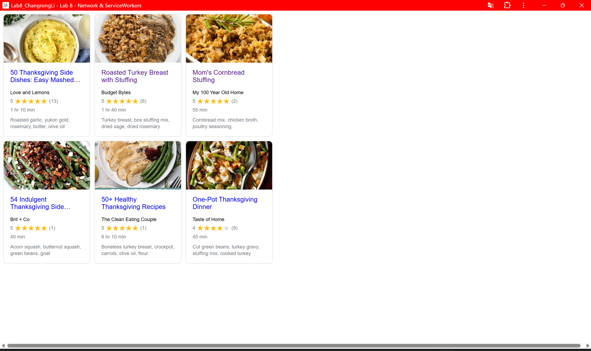

# Lab8-Starter
## Done by: 
- Changrong Li            
## Deployed GitHub Pages URL: 
-https://changrongli8858.github.io/Lab8/
## Short paragraph about graceful degradation and service workers:
- Graceful degradation ensures that an application remains functional under reduced conditions. Service workers support this by enabling offline access and caching, allowing web apps to operate with limited connectivity. 
## pwa.png:
